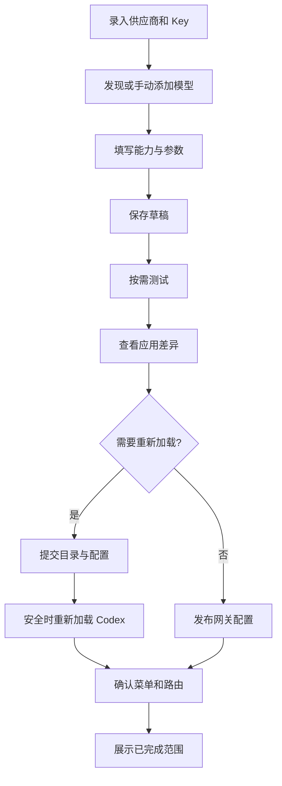

# 页面设计与关键流程

## 1. 信息架构

```text
Switchelp
├── 概览
├── 供应商
│   └── 供应商详情：连接 / API Key / 模型
├── 模型
│   └── 模型编辑：基本信息 / 长度 / 输入与工具 / 思考 / 生效预览
├── Codex 配置
│   ├── 安装实例与有效配置
│   ├── 待应用差异
│   └── 备份与恢复
├── 连接诊断
├── 日志
└── 设置（侧栏底部）
```

全局顶部不放二级导航商城或账号入口。语言、主题、后台行为在设置中。模式状态始终可见：原生模式 / 第三方模式 / 等待加载，不要求用户理解内部 Bridge。

## 2. P01 首次接入

目的：建立正确目标实例，并完成第一条可用链路。

首屏是三个可返回步骤：“检测 Codex → 添加供应商和模型 → 测试并应用”。检测失败显示安装指引和手动定位，不自动下载 Codex；多个实例必须让用户选择，不能自动挑正在运行的任意同名程序。

检测结果包括版本、配置目录、是否运行、是否存在第三方管理痕迹。发现冲突时用户可先保存供应商，应用步骤暂停在冲突说明，不丢前面输入。首次流程允许跳过在线测试保存草稿，但不能将未测试模型显示为已验证。

完成页显示具体模型名和“在 Codex 模型选择器中选择”，附验证状态；没有真实加载证据时使用等待状态，而不是庆祝成功页面。

## 3. P02 概览

```text
┌ 侧栏 216 ────┬─────────────────────────────────────────────┐
│ Switchelp    │ 概览                         + 添加供应商    │
│ 概览         │ 当前实例 · 第三方模式 · 版本信息              │
│ 供应商       ├─────────────────────────┬───────────────────┤
│ 模型         │ 当前配置                │ 连接状态          │
│ Codex 配置   │ 服务商 A · Model X       │ 本地服务 已运行    │
│ 连接诊断     │ 后续请求：工作 Key       │ 模型调用 已通过    │
│ 日志         │ [打开 Codex] [查看模型]  │ Codex 等待加载     │
│              ├─────────────────────────┴───────────────────┤
│              │ 供应商                          [管理全部]  │
│              │ A  2 Key / 3 模型          最近检测 2 分钟前 │
│              │ B  1 Key / 1 模型          尚未测试         │
│ 设置         ├─────────────────────────────────────────────┤
│ 服务运行中   │ 2 项修改待应用       查看差异  [应用到 Codex] │
└──────────────┴─────────────────────────────────────────────┘
```

主标题下只用一句话说明状态。当前配置卡显示本工具设置的默认路由，不谎称是 Codex 当前每个会话正在用的模型；有活跃请求证据时另列“最近请求使用”。

无供应商：一张“添加第一个供应商”空态；网关异常：状态卡变为具体错误与启动/诊断动作；有未应用修改：底部应用栏常驻。首页不展示没有可靠来源的余额、成功率和 Token 节省统计。

## 4. P03 供应商列表与详情

列表页：标题、搜索框、状态筛选、添加按钮，默认显示用户已添加供应商；“从预设添加”是创建入口，不把几十家未配置厂商挤进日常列表。

点击一行进入列表/详情双栏；详情顶部为名称、endpoint、状态，菜单有停用/删除。页签：连接、API Key、模型。每个页签独立脏状态，切换保留草稿；离开页面时只在有未保存内容时提示。

连接表单：

| 字段 | 必填 | 规则 |
| --- | --- | --- |
| 名称 | 是 | 1–64 字符；显示名不参与路由 |
| Base URL | 是 | 完整 URL；HTTPS 默认；显示规范化预览 |
| 协议 | 是 | Responses / Chat Completions；其他协议按适配器开放 |
| 认证方式 | 是 | API Key；本地无认证需明确标记，仍使用本机网关认证 |
| 自定义 headers | 否 | 高级区；敏感值安全存储；禁止覆盖内部路由保护字段 |
| 代理与超时 | 否 | 高级区；默认使用应用网络策略 |
| 备注 | 否 | 最大 500 字符 |

底部“保存供应商”，旁边“测试连接”需已保存或临时测试快照，清楚标明正在测哪个版本。保存后不自动发探测；URL 改变使旧探测结果 stale。

API Key 页使用 CredentialRow，顶端显示默认固定策略与当前 Key。模型页显示该供应商模型、“获取模型”“手动添加”。获取失败不禁用手动添加；获取为空不自动删除旧模型。

删除供应商弹窗列出 N 个模型、N 个 Key 以及正在使用情况。默认先停用并从待发布目录移出；恢复与安全凭据删除是可追踪操作，不能只移除列表行。

## 5. P04 模型目录

工具栏：搜索名称/精确 ID，供应商筛选、可用/未测试筛选、添加模型。列表列定义见组件规范，支持排序：名称、供应商、最近测试；不按伪造质量分排名。

行主操作“编辑”，次操作“测试”，菜单“复制 ID、纳入/移出 Codex、删除”。选中多行出现批量操作条，显示跨几家供应商、测试数和调用提示。

模型状态包括“未选择用于 Codex”，不能所有发现到的模型都自动塞进原生菜单。支持只保留常用模型，减少 Codex 菜单噪声。

## 6. P05 模型编辑器

复杂表单使用独立页面，顶部面包屑“模型 / Model X”，固定页尾“保存草稿 / 保存并查看应用差异”。右侧可折叠“生效预览”，窄窗口放到表单底部。

```text
模型 / 自定义代码模型                       [测试模型]
────────────────────────────────────────────────────
基本信息
供应商 [A]  上游模型 ID [vendor/model-x]
显示名称 [代码模型]   上游协议 [Responses]

长度限制                           来源 / 生效位置
上下文 [128000] Token               用户填写 / Codex 目录
最大输出 [8192] Token               用户限制 / 网关请求
压缩阈值 [自动建议 102400]          建议值，待目录应用

输入与工具
文本   原生可用       已验证
图片   [未知 v]       尚未验证          [测试]
PDF    当前链路不可用                   查看原因
视频   当前链路不可用                   查看原因
工具   function 已验证 / 并行 未验证

思考模式
控制方式 [档位]  可选 [low] [medium] [high]
默认 [不指定]    映射 reasoning.effort

生效预览：输出限制可发布；目录修改需 Codex 重新加载
────────────────────────────────────────────────────
[取消]                 [保存草稿] [保存并查看应用差异]
```

该线框数值是示例，不对应具体供应商。真实来源缺失时留空。

长度字段旁解释“上下文包含历史、指令、工具信息和输出预留”；输出字段解释“设定请求上限，不保证模型输出恰好这么长”。最大输出不得用滑杆作为唯一输入，精确数值优先。

能力输入允许 supported / unsupported / unknown，另有 native / converted / tool_read 的路径显示。当前不可执行的 PDF/video 仍可记录厂商声明，但不允许“加入 Codex 原生能力”勾选。思考档位是可添加字符串的受校验集合，不是全局硬编码下拉。

保存前校验：模型 ID 不空、默认档位合法、预算关系正确、目录投影可生成、选中功能有映射。错误就地显示并总结顶部 N 项问题；保存草稿只要求基本身份成立，应用才要求完整可执行。

## 7. P06 Codex 配置与应用

顶部实例选择器和三项状态：已保存版本、已发布版本、Codex 已观测版本。主区是“当前接入方式”“默认模型”“受管理字段”“最近备份”。高级区展示脱敏 TOML 和配置层来源，只读默认。

“查看差异”页面分组：供应商路由、模型目录、请求策略、需要重新加载的项目。每组列出改前/改后和作用范围；顶部固定目标应用、配置路径与版本。底部主按钮根据计划写“应用”或“应用并重新加载”。

执行页显示校验→准备→提交→重新加载→核验。处于不可安全取消的提交阶段，取消按钮变为不可用并说明短暂原因；不是把关闭窗口等同于取消任务。

忙碌实例给“保存并稍后重新加载”和明确的重启操作；不默认中断正在生成的任务。原生恢复显示撤销字段与会保留的本工具供应商，冲突时转三方比较。

## 8. P07 连接诊断

先选供应商、模型、Key、协议/修订；默认最小文本+流式+工具检查，图片/推理扩展按用户勾选。开始按钮旁说明合成测试与可能费用。结果以阶段时间线显示，失败后不继续无意义的后续项目。

右侧“建议处理”使用结构化错误码；底部“复制诊断摘要”。无网络、TLS 失败、401、模型不存在、只支持 Chat、工具未返回、SSE 中断、Codex 未加载分别给可执行建议，不统一显示“Key 无效”。

连接测试不包含“清理认证/清空缓存/重装 Codex”等不相称自动动作。

## 9. P08 日志

按时间、级别、供应商、请求/应用事务筛选；默认显示最近 200 条并分页。表格字段是时间、类别、目标、结果、耗时；详情抽屉展示安全元数据和关联事件。全文搜索仅在脱敏字段中进行。

“清空日志”只影响本工具诊断；不删除 Codex 历史。导出打开本地保存对话框，先展示脱敏包内容清单。用户离线时日志仍可读。

## 10. P09 设置与托盘

设置分组：外观/语言、后台运行、Codex 实例、网络、日志保留、备份与更新、关于。危险操作与日常开关分开，不把恢复配置和主题开关放同一行。

托盘菜单：当前模式/服务状态、打开 Switchelp、已配置固定 Key 快捷选择、打开 Codex、暂停新请求、退出。模型切换只对未来请求默认值生效；不能声称已改变当前任务模型。快捷动作沿同一后端事务，不能写第二套配置逻辑。

## 11. 流程约束



保存、测试、应用可顺着同一页面完成，但语义不合并。允许保存未验证草稿；不允许通过 UI 把未知能力自动标成已验证。
