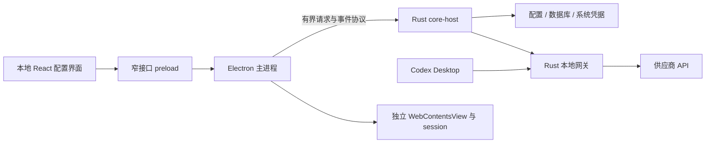

# 桌面壳复审：Tauri 与 Electron

日期：2026-09-18 · 状态：方案复审，未创建工程或进行两种壳的性能测试。

关联：[总体架构](../architecture/01-system-architecture.md) · [参考调研](01-reference-projects.md) · [开发计划](../development/01-implementation-plan.md)

## 1. 本次结论

当前方案是 **Tauri 2 + React + TypeScript + Rust**，尚未实现。按现有“Codex 配置管理工具”的范围，继续保留 Tauri；供应商网站和帮助链接默认使用系统浏览器打开。这是基于现有范围的设计假设，不代表用户已经明确排除了未来浏览器功能。

如果首版或已确定的近期路线需要持续使用的内嵌供应商控制台、多标签、独立登录会话、网页下载等能力，推荐在 G1 创建工程前切换为 **Electron + React + TypeScript + Rust core-host**。不必等 Tauri 无法实现后再换；浏览器能力成为核心产品需求，本身就是复审条件。

本次立即调整的是核心与桌面壳的依赖边界，并增加选型门槛。暂不为了预备另一种壳而实现两套工程、跨进程协议或浏览器模块。

随后补查用户指定的 DSH Desktop：确认 Electron，但主要承载自己的本地 Web UI，核心主路径限制跨源导航并将新开链接交给系统处理。这不等于内置任意网站的多标签浏览器，因此没有改变当前产品范围。具体代码证据和可采用做法见 [DSH 补充调研](04-dsh-reference.md)。

再核对 CodexSplit：其公开 macOS 实现是 SwiftUI/AppKit + WKWebView + TypeScript/Node sidecar，Dashboard 使用 HTML/CSS/JavaScript；没有使用 Electron 或 Tauri。Windows 源码未公开，技术栈未确认。这说明“网页界面 + 本地核心”并不限定 Electron；其视觉风格也不决定桌面壳选型。分层证据见 [CodexSplit 调研](01-reference-projects.md)。

## 2. 新证据及其解释范围

用户转述星算助手开发者：

> 对的。之前是 tr，那玩意塞浏览器太亏，后面就换成 en 了。

结合已安装 1.6.1 的 Electron 入口、preload 与 Rust core-host，本文将 tr / en 理解为 Tauri / Electron。这条转述补充了迁移历史与开发者给出的理由；上轮“官网写 Tauri、安装包为 Electron”的差异现在有了合理解释。消息没有提供迁移日期、性能数据，也没有说明“太亏”具体指开发时间、包体、内存还是其他成本。

**工程判断**：当产品要内置浏览器时，统一 Chromium 和现成网页管理 API 可减少需要自行适配的环节。这与迁移理由相符，但不能进一步断言星算助手嵌入了某种特定浏览器实现，或 Electron 在所有场景都更轻、更快。

证据分层：安装包结构属于本地观察；迁移原因属于用户转述；对本项目的选型结论属于设计判断。

## 3. “显示网页界面”与“内置浏览器”

两种方案都可以用 React 写本工具的表单、表格和卡片。Tauri 在 macOS 使用系统 WebKit/WKWebView，在 Windows 使用 WebView2；做这些本地界面不要求额外打包一个浏览器。[Tauri Webview Versions](https://v2.tauri.app/reference/webview-versions/)

Electron 随应用提供 Chromium 与 Node.js，采用主进程和 renderer 等多进程结构。它的优势之一是应用可以统一所用引擎版本，代价是要随产品分发和维护这套运行时；具体安装体积、空闲内存和启动速度仍要测量。[Electron Introduction](https://www.electronjs.org/docs/latest/)、[Process Model](https://www.electronjs.org/docs/latest/tutorial/process-model)

内置浏览器则额外涉及网站兼容性、标签生命周期、登录 cookie、会话隔离、弹窗、下载、权限和网页崩溃恢复。Electron 提供 `WebContentsView` 承载网页，以及 `session` 管理会话、cookie、缓存和代理；本项目若进入这一范围，优先采用这些接口。[WebContentsView](https://www.electronjs.org/docs/latest/api/web-contents-view)、[session](https://www.electronjs.org/docs/latest/api/session)

Tauri 也能显示远程网页，不能写成“不能内嵌浏览器”。差别是本项目要在不同系统引擎和平台能力上完成哪些适配，以及这些工作是否值得投入。网站是否允许嵌入、第三方登录是否接受内嵌环境，仍需逐站验证，换成 Electron 不构成通过保证。

## 4. 针对本项目的对照

| 场景 | Tauri 2 + Rust | Electron + Rust core-host | 本项目判断 |
| --- | --- | --- | --- |
| 供应商、Key、模型参数表单 | 可以完成，需测双平台 WebView | 可以完成，引擎版本统一 | 两者均可，不决定选型 |
| 配置文件、凭据库、本地网关 | Rust 核心可在主进程中运行 | 主进程管理 Rust 子进程 | 两者均可，Electron 不要求改写核心为 JS |
| Codex 原生菜单、模型真实路由 | 依赖 Codex 接入与网关 | 同样依赖 Codex 接入与网关 | 换壳不会自动解决校准问题 |
| 打开供应商官网 | 调系统浏览器 | 调系统浏览器 | 无需内嵌浏览器 |
| 少量固定远程页面 | 能做，但须测引擎差异 | 可用独立网页视图 | 如果必须内嵌，按目标网站做有限验证 |
| 多标签、持久会话、下载 | 需核对各平台能力和适配成本 | 网页与会话管理接口更契合 | 此需求确定时优先 Electron |
| 包体与运行时维护 | 复用系统 WebView，仍有系统依赖 | 分发 Chromium/Node，需跟进安全更新 | 不根据未测数字承诺资源收益 |
| 常驻代理资源 | Rust 网关与 UI 分工清楚 | Rust 网关独立，但主进程仍有开销 | 统计全进程树，不能只算 Rust |
| 开发维护 | Rust/TS 两种语言 | 若保留 Rust，同样是两种语言，增加子进程协议 | 是否更快取决于需求和团队经验 |

API 模型支持文本、图片、PDF 或视频，并不自动意味着本工具需要浏览器。此前的能力配置、协议转换和附件约束都在 Codex/网关链路中处理；不能把模型模态需求当作内嵌浏览器需求。

## 5. 现在应落实的架构边界

1. `switch-core` 独立为 Rust library crate，负责配置、凭据、模型、数据库、网关和诊断，不依赖 Tauri 类型。
2. Tauri command handler 只做来源/参数校验、调用用例、转发事件；窗口和托盘 API 留在壳适配层。
3. React 通过类型化 `DesktopClient` 调用业务命令；只有 transport 文件知道 Tauri `invoke/listen`，业务组件不直接散布框架调用。
4. OS 文件、凭据与进程适配可放核心的 platform 模块；窗口、托盘、打开外部网页属于桌面宿主职责。两者不混在一个需要 UI 运行时的服务中。
5. 初版只维护一个实际 transport 与一个壳。目录、DTO、配置所有权和路由 Revision 不随壳变化。

这能减少迁移时的业务改动，但不能承诺“换壳零成本”。进程生命周期、事件订阅、更新、签名、权限和真实窗口测试仍需重做。

## 6. 如果采用 Electron，具体如何实现

以下是有条件的备选架构，尚未进入当前开发基线。

- Electron 主进程负责窗口、托盘、网页视图、更新和子进程管理；配置事务与上游网络保留在 Rust。推理流量不绕经 React 或主进程 IPC。
- Rust core-host 由受控路径直接启动，使用私有 stdin/stdout 管道；带协议版本握手、requestId、取消、超时、消息尺寸/队列上限和子进程退出事件。stdout 专用于协议，stderr 仅输出脱敏日志。现有业务命令复用，不能原样开放任意 shell 或文件命令。
- 本地界面只获得具体业务方法；主进程验证 IPC 来源和参数。远程网页不加载配置界面的 preload，不获得 Key、配置写入或 core-host 接口。启用 `contextIsolation`、`sandbox`，关闭 `nodeIntegration`，限制导航、弹窗和网页权限。[Electron Security](https://www.electronjs.org/docs/latest/tutorial/security)
- 网页使用 `WebContentsView`，由主进程控制生命周期。按用途/账户分配 session；相同 `persist:` partition 会共享持久会话，不能只按标签编号随意复用。网页登录 cookie 与 API Key 存储隔离，不自动抓取网页 Key。[session](https://www.electronjs.org/docs/latest/api/session)
- renderer 崩溃可恢复界面而不主动重启核心；主进程退出时默认受控停止核心，孤儿清理按 OS 实现。core-host 崩溃必须显示网关中断，已断开的流不能伪装为续传，也不能无限重启。
- 关闭窗口可以保持托盘和网关，但隐藏窗口不等于释放 renderer。是否销毁闲置窗口必须结合草稿保存与重开延迟实测。

切换后需要同步修改总体架构、IPC 传输、安全与平台矩阵、工程目录、签名更新流程、测试计划和资源预算。只替换文档中的框架名称不算完成迁移方案。

## 7. 决策门槛与验证

| 条件 | 决策 |
| --- | --- |
| 按当前范围做配置管理，网页外开 | 保留 Tauri 2；先实现壳无关核心 |
| 仅增加一个简单固定网页，内嵌是否必要未定 | 先确认外开能否满足；必要时验证该网页，不直接扩成浏览器 |
| 已确定内嵌控制台是高频流程，或需要多标签/隔离登录 | G1 前优先改 Electron + Rust core-host，并重估工作量 |
| 团队明确只维护 TypeScript，不维护 Rust | 另行评估 Electron + Node 核心；不能假装当前 Rust 设计可以原样落地 |
| Codex 菜单/配置接入失败 | 排查 CodexAdapter、目录、认证、Bridge；不把换桌面壳当修复 |

G0 增加一次壳选型检查。没有内嵌需求时，无需为了比较而开发两套 PoC。有内嵌需求时，记录代表性网站、登录/弹窗/下载场景，在 macOS 和 Windows 真机验证；如果目标登录拒绝内嵌，保留系统浏览器路径。

资源记录至少包括：安装体积、首次启动、窗口打开与关闭后的全进程树内存/CPU、持续网关流量、代表性网页打开数量、网页崩溃后的网关可用性。统一设备、版本和场景，避免用 Tauri 单进程数据对比 Electron 全进程数据。原 PRD 的内存数字只是当前基线目标；Electron 或网页范围确定后须重估，不能继续沿用原工期与预算作承诺。

## 8. 本次文档调整

- 将星算助手的迁移原因从“未知历史”更新为“用户转述”，保留事实边界。
- 桌面壳复审从“遇到无法解决的 WebView 问题再考虑”提前到“浏览器需求明确后、创建工程前”。
- 配置与网关核心抽成独立 crate，桌面 IPC 采用薄适配层。
- 当前按已知范围保留 Tauri；没有将浏览器功能自动加入 P0，也没有开始开发。
